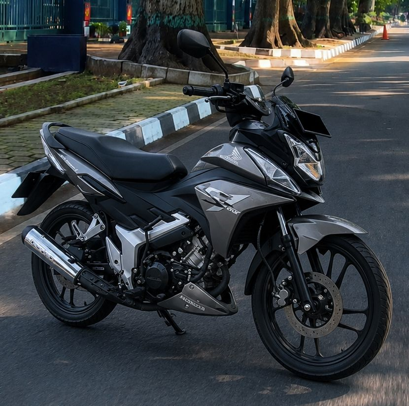

# Memories

## 2026

### Riset Juni-Juli
Progress Review terlewati, artinya tanggung jawab semakin berbentuk, semakin jelas. Ngambil peluang sekaligus tantangan, artinya siap untuk cerdik mengelola progres demi progres. Nama adalah doa. 

## 2020

### Jabar Data Stronghold
Cuaca yang paling keinget ketika itu adalah hujan, mendung, sunyi... siang tersunyi untuk hari biasa di depan Gedung Sate. Jalan begitu lengang. Masih keinget Februari awal masuk kerja, diwawancara 2 sohabat data, ngantor di rumah gede, dapet tugas integrasi data ke pusat, nginep di penginapan tertentu, trus pindahan kantor ke tempat bersih canggih, mulai eksplorasi arsitektur terdistribusi, mulai kerasa seru, eh, tiba-tiba Covid-19 dateng, situasi jadi serba darurat, ga sampe 2 hari kemudian kantor baru bernuansa digital itu, tiba2 jadi markas koordinasi, di jaga polisi-polisi, situasi agak sedikit tegang, dan dimulailah era Pikobar, satu periode kerja yang mungkin sangat diinget temen-temen ketika itu.

## 2013

### Dtracker
Target awal waktu itu Honda CS1. Mungkin karena harganya relatif lebih terjangkau, untuk bentuk yang kokoh dan unik. Entah gimana, jadinya Kawasaki Dtracker. Kenapa enggak KLX ya.. hmm.. ketika itu modelnya ga banyak, cuma ada KLX hijau, dan Dtracker orange. Karena roda jalan kayanya, biar bisa dipake harian. Kawasaki Cimahi selepas turunan jembatan Cimindi kalo dari arah Bandung. Kayanya motor itu emang terlahir untuk berkarir di kaki dua gunung Burangrang - Tangkuban Prahu.

Hari Sabtu atau Minggu, iseng, dari Another Room ke kampung halaman sisi timur Cidurian, via Gunung Manglayang. Ke Lembang dulu via Ciumbuleuit.. lalu belok kanan ke daerah Cibodas Lembang,, nyusurin isi utara patahan-patahan KBU, nyusur masuk kawasan Bukit Tunggul, langit kelabu, suasana jalan berbatu yang sepi bikin nuansa cukup memorable,, pertama kali liat dan lewat jalan kayak gini, apakah nanti bener bisa turun ke Cilengkrang ato engga, alhamdulillah bisa, turun via Cilengkrang, AH Nasution, Cinambo, Soekarno-Hatta. Seru juga. Sampe di rumah, lagi ada tamu, sore2 langit yang masih kelabu. Uji jalan mesin baru. Gatel juga ingin ngemodif bodynya dengan aneka stiker.

[Let it Go - Avril Lavigne](https://music.youtube.com/watch?v=FZ3-B2qKIEQ&si=Nt4VJol9rRvx6Vwi)
[Perjalanan Terindah - Hoolahoop feat. Aska Rocket Rockers](https://music.youtube.com/watch?v=3WUzxnyRmOQ&si=QqeFDCvFjw67kf3Q)

## 2012

### Pulau Payung
Agustus 2012. Laut sunyi terang bulan tengah malam dari pelabuhan Muara Angke ke Pulau Payung.

[Trip The Darkness - Lacuna Coil](https://music.youtube.com/watch?v=l8dIPxvzIW8&si=smDB_i5XGJxDSOW2)

## 2011

### Another Room in Cihampelas
[Even If She Falls - Blink 182](https://music.youtube.com/watch?v=y6Zur1TZNts)
[Fast Car - Tracy Chapman](https://music.youtube.com/watch?v=IJ8i49EqgYI)

## 2010

### A Room in Cihampelas
Dari depan kamar, teras jemuran lantai 2 sisi timur rumah, hamparan lembah sungai Cikapundung daerah Cihampelas bagian utara. Sabuga keliatan ga begitu jauh, rumah-rumah menuju arah sungai makin ke bawah hingga atap-atap keliatan bersusun makin rendah, dengan segala atributnya kayak jemuran, aneka genteng, aneka bentuk bangunan, di pemukiman serba gang, serba jalan miring curam. Dari sana sebenernya ga terlalu jauh ke kampus kalo aja jalan menuju penyeberangan kayu itu ga muter-muter, tinggal lurus, kalo bisa gitu enak banget sih, via terowongan langsung masuk. Pemandangan malemnya selalu keinget, sinar-sinar lampu rumah yang deket, lampu2 sabuga, kawasan gelap pohon-pohon tinggi yang berderet dari mulai Batan sampe ujung kebun binatang Bandung, hamparan pemukiman sekitar sungai hingga jembatan Pasopati dengan lampu-lampunya. 15 Meteran dari mesjid, tiap jum'atan jamaah luber sampe ke teras, keluar kamar langsung duduk gelar sajadah. Kamar mandi ada di lantai bawah, tembok dan lantainya dari bahan semen kayanya yang udah mulai hitam, mungkin ada lumut juga, ala 80 an, pake lampu karena gelap ga ada jendela, airnya bener-bener jernih dan seger mungkin karena deket ke wilayah perbukitan.

[Don't Stop Believing - Journey](https://music.youtube.com/watch?v=sXcyiA38z9I&si=YbouLXPg0cjIgeSI)

## 2009

### Aneka Warnet dan Tempat Makan Jalan Plesiran

[The End of Life - Album - Unsun](https://music.youtube.com/playlist?list=OLAK5uy_l824CfBGG6rkfvld7mCP0ar_Y7fCeCeco&si)

## 2008

### Plesiran
Pertama dateng ke sana dianter, gang pertama ke kiri, ada ibu-ibu yang nawarin kostan sekaligus nawarin jasa laundry

### Cikutra Barat
Ada satu tempat langganan laundry yang harganya cukup terjangkau di sana. Kenapa ngelaundry? ah larena ga ada mesin cuci, kayanya ke sana sekitar seminggu sekali. Emang lucu juga, harus naik angkot pirage ke laundry, karena nanjak rada jauh. Dari jalan ada parkiran, terus pintu ala aluminium ada kacanya. Ah keranjang plastik bolong2 putih, lalu nimbang berapa berat cuciannya. Ai plastik buat bawa cuciannya dari mana ya? kemungkinan besar pake plastik bekas sebelumnya kalo abis ambil cucian. Ai ambil cuciannya tiap kapan ya? ah pulang kuliah, turun angkot, ambil. Asa lupa feeling bawa hasil cucian di plastik yang kelipet kesetrika rapih naik angkot biru, padahal cukup rutin.

[Menjelang Hilang - Closeheaad](https://music.youtube.com/watch?v=ESULSnW0HFo)

## 2006

### Awal masuk kuliah
Koak. Jalan yang memutih penuh bercak. Pagi yang mendung. Acara bareng Fakultas Teknik Industri di semacem aula / GOR. Seorang kawan sepertinya beraksi di sana. Sebelum itu, penerimaan mahasiswa baru di Sabuga. Seperti biasa, nuansa ketika ngeliat wajah2 baru, yang kebanyakan berlogat gue elu, logat yang ketika itu entah kenapa dengernya bikin minder. Mulai liat tiap wajah yang ada di sana, mulai menebak-nebak karakter. Cari-cari temen yang dikenal. Beres dari sana, masuk ke kampus, tapi di pagi yang mendung itu kampus kayanya masih sepi, belum mulai perkuliahan. Kalo ga salah mesin ada kumpul perdana di ruang kkuliah jurusan. 

## 2005

## 2004

### Light of Electrical Dreams 2024

## 2003

### Ospek masuk kelas 1 SMA
Beli bahan-bahan ospek di toko buku Singgalang.

### SSC Sebuah Dago

## 2002

## 2001

### Battle Realms

## 2000

### Inocrea - Age of Empires 2

### Ospek masuk kelas 1 SMP

## 1997-1999

### Algris
Semacem tempat untuk ngerental PS, ato game, apa ada hubungannya dengan koin? ato ada rental PS plus game pake koinnya? lokasinya ada di jalan lurusan jalan utama Metro Margahayu Raya pas mau belok kanan ke terminal, kalo dari arah Soekarno Hatta.

## 1993

### Rumah Baru
Awal-awal pindahan rumah, bentuk rumah-rumah masih sama semua. Naik motor Honda warna merah putih boncengan ber empat, Bapa, Um Enang, dan Um Emuk. Liat bapak-bapak komplek kumpul, kayanya sambil jongkok deket babakaran, sambil nyeruput minuman-minuman kaleng. Di lahan kosong 70 meter an arah timur rumah, ada satu gudang memanjang dan tertutup, setelah lahan tersebut, ada satu selokan agak gede lebar 1-1.5 meter an, dengan airnya yang warnanya kehitam-hijauan mungkin ada banyak ganggang di sana, dan ada beberapa tanaman dan pohon di sisi sebrangnya. Ingetan di waktu ini kebanyakan nuansa mendung ato jelang sore.

### Ade Lahir
Ketika itu pas bangun pagi-pagi, tau-tau Mamah Bapa ga ada, kata Papih Mamih mereka lagi ke rumah sakit, tau-tau siangnya bawa bayi, yaitu si Ade. Masih inget ketika suatu hari disuruh jagain si Ade di kasur, kasurnya cukup gede, entah gimana pindah tempat ke sisi deket tembok, dan entah gimana Ade ngeguling dan jatuh dari kasur, nangis keras. Ada juga momen si Ade lagi dimasukin ke box bayi, trus tiba-tiba ada semburan padet terus berputar seperti selang tapi itu bukan selang. Ada juga momen difoto sambil mangku si Ade di kursi halaman depan yang bangkunya menghadap timur.

## 1989-1992

### Haur Pancuh dan Pemilu 9 Juni 1992
Pemilu 9 Juni 1992 kayanya salah satu momen yang cukup jelas di ingetan, ada panggung dan bilik pemungutan suara, yang kalo ga salah tiap bilik itu disekat-sekat oleh kain terpal biru ato kain biru,, termasuk pembates dengan area luar. Ada kursi-kursi ala ondangan juga. Ketika itu nangis ingin ikut nyoblos, tapi ga dibolehin, kayanya penting banget untuk ga ikut masuk, ketika nangis, di serahin dulu ketetangga oleh Mamah, disuruh baca kata-kata di area pencoblosan. 

### Ingetan-Ingetan Awal
Kayaknya ingetan pertama hidup ada di taun-taun ini, terutama ketika dimandiin di halaman ketika sore hari, sepertinya ketika mulai mau matahari tenggelam, sinar mataharinya masuk ke area mandi, area rumah Papih Mamih itu belum jadi ruangan tamu, masih area terbuka, lantainya kayak ubin batu ato abu-abu khas jaman itu. Mandinya di jolang, kayanya sempet dibanjurin juga berdiri turun dari jolang. Kayanya ada taneman hijau juga di situ, pohon pandan kayanya.

Setelah itu.. taun 1991 an kayaknya inget pernah kasura, nuansa ingetan ketika itu rumah sodara yang temboknya putih, ada halaman rumput juga kayaknya, ada nuansa abu juga di luar rumahnya, taun-taun sesudahnya baru tau kalo ketika itu sempat tinggal di situ. 
